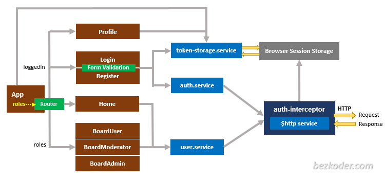

# Angular 13 Login and Registration with JWT and Web API example

Build Angular 13 Token based Authentication & Authorization Application with Web Api and JWT (including HttpInterceptor, Router & Form Validation).
- JWT Authentication Flow for User Registration (Signup) & User Login
- Project Structure with HttpInterceptor, Router
- How to implement HttpInterceptor
- Creating Login, Signup Components with Form Validation
- Angular Components for accessing protected Resources
- How to add a dynamic Navigation Bar to Angular App
- Working with Browser Session Storage

## Flow for User Registration and User Login
For JWT – Token based Authentication with Web API, we’re gonna call 2 endpoints:
- POST `api/auth/signup` for User Registration
- POST `api/auth/signin` for User Login

You can take a look at following flow to have an overview of Requests and Responses that Angular 13 JWT Authentication & Authorization Client will make or receive.

## Angular JWT App Diagram with Router and HttpInterceptor

